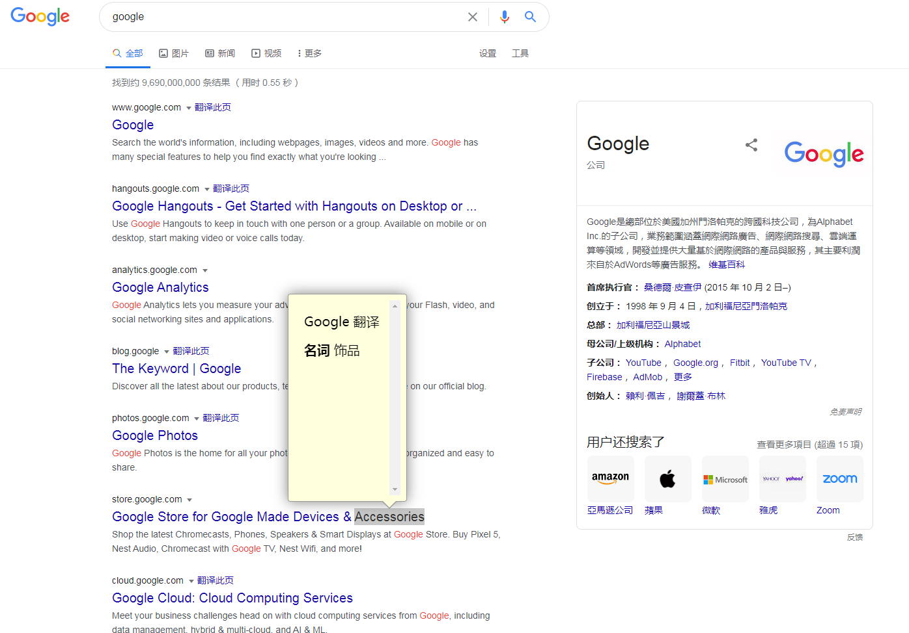

# surfingkeys插件 使用的谷歌翻译

### 样子比较简陋 但是能用



---

### 代码如下 拷贝到surfingkeys的设置里面保存就能用

``` javascript
// 自定义词典
Front.registerInlineQuery({
    url: function(q) {
        return `https://translate.googleapis.com/translate_a/single?client=gtx&sl=en&tl=zh-CN&hl=zh-CN&dt=t&dt=bd&dj=1&source=bubble&q=${q}`
    },
    parseResult: function(res) {
        const resObj = JSON.parse(res.text)

        if (resObj.dict && Array.isArray(resObj.dict) && resObj.dict.length > 0) {
            let con = document.createElement('div')
            con.style = "padding:0 15px;font-size:20px;line-height:1.2;min-height:300px;overflow:auto;"
            con.innerHTML = '<p>Google 翻译</p>'
            resObj.dict.forEach(d => {
                con.innerHTML += `<p><b>${d.pos}</b> ${d.terms.join(';')}<p>`
            })
            return con.outerHTML
        } else {
            return false
        }
    }
});
```
